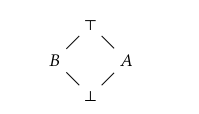

# IFC Extension of P4 Typechecker

The reference P4 compiler implementation is already modularized into different phases---frontend, midend, and backend. To extend the typechecker we modified the typechecker (in `frontends/p4/typeChecking/`), the lexer and parser (in `frontends/parsers/`), and the intermediate representation of the abstract syntax tree nodes (defined in `ir/`). In the following parts we discuss the changes made in each part on top of the reference P4 compiler.

## Parser Extensions for Handling Security Types
We add the following rules to the existing lexer rules that are defined in the file `frontends/parsers/p4/p4lexer.ll`:
1. _low_ --> LOW
2. _A_label_ --> ISOLATED_1
3. _B_label_ --> ISOLATED_2
4. high --> HIGH

These tokens correspond to the security labels in the following lattice:

The parser definition that is present in `frontends/parsers/p4/p4parser.ypp` needs to be also updated to parse the token for any new security label. For example, `"<" BOOL "," LOW ">"` rule instantiates an object of type `bool` with security label `low` and its handler sets the appropriate security label.

## Abstract Data Type Extensions
The intermediate representation defines the data types for different abstract syntax tree nodes. We extend them with an additional field for `PC` and `secLabel` in the following files `ir/base.def`, `ir/ir.def`, `ir/type.def`.

Some of the new types that were defined are as follows for x being the lattice elements, {low, high, isolated_1, isolated_2}:
1. Sec_Type_Bits_x
2. Sec_Type_Boolean_x
3. Sec_Type_String_x

These classes also provide getter and setter functions for `pc` and `secLabel`.

## P4 Base Typechecker

The original typechecker pass is implemented as a linear postorder traversal through the abstract syntax tree. In case of a typeError, it is signalled using the `typeError` macro.

While extending the typechecker for the IFC setting, we use the additional fields of the abstract syntax tree node's object, like `pc` and `secLabel` to encode the typing rules applicable to the corresponding node.

## Extending the Base Typechecker
**Helper Functions** in `frontends/p4/typeChecking/typeChecker.cpp`:

1. `bool is_isolated_label(int label_a)`: returns **True** if `label_a` is a label that is in the width of the diamond lattice, and **False** otherwise.

 
2. `bool is_violating_isolation(int label_a, int label_b)`: returns **True** if `label_a` and `label_b` are two label in the width of the diamond lattice, and **False** otherwise. This function is called as a part of the assignment statement typechecking---an assignment between violating isolation levels shouldn't be permitted.

## Additional Changes

To register a new commandline option, for instance, `--ifc-stats`, the option handling needs to be added to the following file,
`frontends/common/parser_options.cpp`. 
 
 ## Changing the Supported Lattice
To change the lattice and introduce new security levels, corresponding security type needs to be reflected at all the above places.